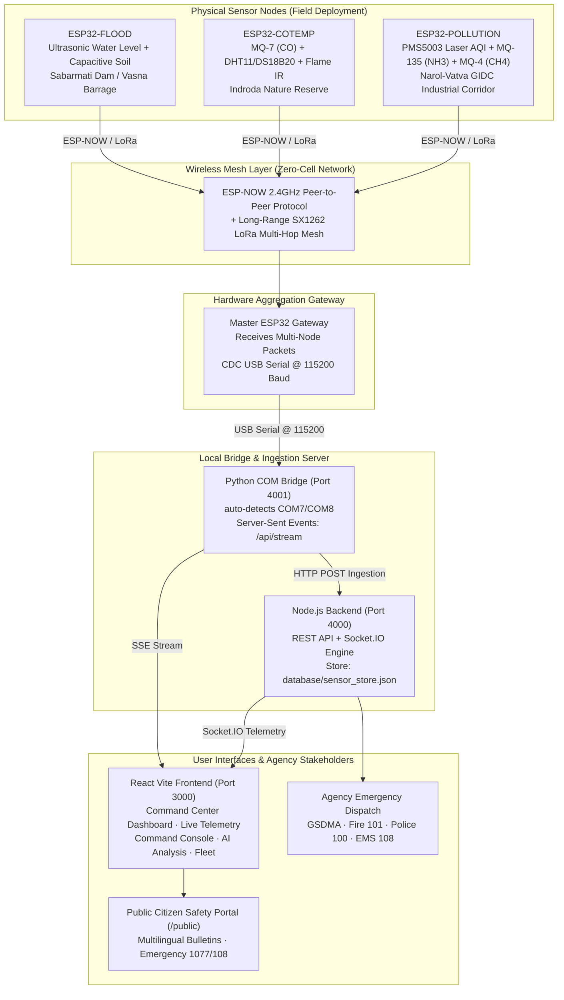

# 🌪️ Code Vortex · AegisNet
### **AI-Powered Edge Environmental Monitoring & Multi-Hazard Disaster Early Warning Network**

> **Official State Disaster Network · Built for Gujarat State Disaster Management Authority (GSDMA)**  
> *Real-Time Telemetry · Multi-Hop LoRa Mesh · Physical ESP32 Hardware Integration · Edge-AI Correlation · Multi-Agency Automated Dispatch · Public Citizen Safety Portal*  
> **Track:** Smart Automation & Qualcomm Edge-AI Hardware Sentinel  
> **Target Geographic Zones:** Gandhinagar (Capital/Sabarmati), Ahmedabad (Metro/Vatva GIDC), Surat (Hazira Coastal/Industrial), Vadodara (Nandesari Petrochem)

---

## 📑 Table of Contents
1. [Executive Summary & Problem Statement](#-1-executive-summary--problem-statement)
2. [End-to-End System Architecture](#-2-end-to-end-system-architecture)
3. [Physical Hardware & Sensor Specifications](#-3-physical-hardware--sensor-specifications)
4. [Software Architecture & Microservices](#-4-software-architecture--microservices)
5. [Complete Page-by-Page Feature Specifications](#-5-complete-page-by-page-feature-specifications)
6. [Security & Public Portal Isolation](#-6-security--public-portal-isolation)
7. [Quick Start & Execution Guide](#-7-quick-start--execution-guide)
8. [Demo Scenarios & Simulation Engine](#-8-demo-scenarios--simulation-engine)
9. [Project Directory & File Structure](#-9-project-directory--file-structure)
10. [Authentication & Role Directory](#-10-authentication--role-directory)

---

## 🌟 1. Executive Summary & Problem Statement

### The Critical Problem
Traditional disaster monitoring in critical ecological and industrial zones (such as river catchments and chemical industrial estates in Gujarat) suffers from fundamental systemic vulnerabilities:
1. **Cloud Latency & Network Collapse:** Conventional IoT systems rely on streaming raw readings to centralized cloud servers over cellular 4G/WiFi. When severe cyclones, flash floods, or landslides strike, power lines break and cellular towers fail—halting monitoring exactly when disaster strikes.
2. **Alert Fatigue from False Alarms:** Fixed-threshold sensors trigger alarms on benign transients (a splash on an ultrasonic probe or vehicle exhaust near an AQI sensor), desensitizing emergency personnel.
3. **Disjointed Multi-Agency Response:** Flood, wildfire, and toxic gas emergencies require simultaneous coordination between GSDMA, Municipal Corporations, Fire Services, Police Control, and EMS (108). In conventional systems, this is delayed by manual phone calls.
4. **Absence of a Verified Public Layer:** Citizens frequently lack direct, localized advisories, relying instead on unverified social media rumors during emergencies.

### The Solution: Code Vortex AegisNet
Code Vortex AegisNet is a decentralized, edge-intelligent disaster monitoring network:
- **Zero-Cell Fallback (LoRa + ESP-NOW):** Field nodes communicate via peer-to-peer ESP-NOW and multi-hop LoRa radio mesh. Even with zero internet or cellular connectivity, local physical alarms fire autonomously in $<3$ seconds.
- **Master Hardware Gateway & High-Speed Serial Bridge:** Master ESP32 collects multi-channel radio packets and streams real-time JSON packets over USB COM UART to a dedicated Python bridge and Node.js ingestion backend.
- **Edge-AI Correlation:** Multi-sensor fusion cross-references water levels with soil saturation, or thermal heat with particulate matter and gas, eliminating false positives before dispatching agencies.
- **Automated Command Console & Multi-Agency Dispatch:** Automated escalation engine routes incidents through an interactive Kanban board (GSDMA, Fire 101, Police 100, Ambulance 108).
- **Isolated Public Citizen Portal:** Dedicated multilingual (English, Gujarati, Hindi) disaster portal where citizens view verified advisories, air quality index, and shelter locators without accessing agency controls.

---

## 🏗️ 2. End-to-End System Architecture



---

## ⚡ 3. Physical Hardware & Sensor Specifications

### Node 1: Flood Sentinel (`ESP32-FLOOD`)
* **Primary Geography:** Sant Sarovar Dam / Vasna Barrage, Sabarmati River Corridor, Gandhinagar/Ahmedabad.
* **Microcontroller:** ESP32-WROOM-32 (Dual-Core 240MHz, 520KB SRAM).
* **Sensors Integrated:**
  1. **Ultrasonic Sensor (HC-SR04):** Measures distance to water surface ($2.0\text{ cm} - 400\text{ cm}$ range). High water surge alerts trigger dynamically if level drops below $20\text{ cm}$.
  2. **Capacitive Soil Moisture Sensor v1.2:** Detects soil saturation percentage ($0\% - 100\%$) to calculate flash-flood runoff probability.
  3. **Vibration Sensor:** Detects structural scouring or dam abutment stress.

### Node 2: Fire & Thermal Sentinel (`ESP32-COTEMP`)
* **Primary Geography:** Indroda Nature Park Perimeter, Gandhinagar Forest Reserve.
* **Microcontroller:** ESP32-WROOM-32.
* **Sensors Integrated:**
  1. **MQ-7 Electrochemical Sensor:** Carbon monoxide (CO) gas detection ($10\text{ ppm} - 10,000\text{ ppm}$).
  2. **DHT11 & DS18B20 Probes:** Dual-temperature precision measurement ($0 - 80^\circ\text{C}$) and relative ambient humidity ($20\% - 90\%$).
  3. **Infrared Flame Detector Sensor:** Optical flame wavelength detection ($760\text{ nm} - 1100\text{ nm}$) with digital interrupt alarm.

### Node 3: Air Quality & Toxic Gas Sentinel (`ESP32-POLLUTION`)
* **Primary Geography:** Narol-Vatva GIDC Chemical Belt, Ahmedabad Industrial Zone.
* **Microcontroller:** ESP32-WROOM-32.
* **Sensors Integrated:**
  1. **Plantower PMS5003 Laser Particulate Counter:** Physical optical particle count yielding exact PM1.0, PM2.5, and PM10 in $\mu\text{g/m}^3$.
  2. **MQ-135 Gas Sensor:** Measures Ammonia ($\text{NH}_3$), Benzene, alcohol, and general air toxic volatiles.
  3. **MQ-4 Gas Sensor:** Methane ($\text{CH}_4$) and natural gas relative strength percentage and raw ADC.

### Master Gateway Receiver (`ESP32-MASTER`)
* **Role:** Central radio receiver and USB serial interface.
* **Firmware:** Listens to peer ESP32 nodes over ESP-NOW, structures unified telemetry packets with node IDs, timestamps, and readings, and broadcasts via USB Serial UART at 115200 baud.

---

## 💻 4. Software Architecture & Microservices

| Service | Port | Technology | Primary Function |
|---|---|---|---|
| **Frontend Web App** | `3000` | React 18, Vite, Tailwind CSS, Recharts, Zustand | Command Center UI, real-time charts, map, incident console, and public safety portal. |
| **Node.js Backend** | `4000` | Node.js, Express, Socket.IO, REST APIs | Handles telemetry ingestion, state persistence (`database/sensor_store.json`), alert dispatching, and WebSocket broadcasting. |
| **Python COM Bridge** | `4001` | Python 3, PySerial, ThreadingHTTPServer, SSE | Directly interfaces with USB COM ports (COM7/COM8), parses multi-line text and JSON streams, and provides `/api/stream` SSE endpoint. |
| **Python AI Engine** | `8000` | FastAPI, NumPy, Scikit-learn (Optional) | Multi-hop spatial correlation, distance-decay calculations, and 6-hour disaster trend projections. |

---

## 🖥️ 5. Complete Page-by-Page Feature Specifications

### 1. Overview Dashboard (`/dashboard`)
* **Executive Metric Cards:** Total Edge Nodes Online, Active Emergency Alerts, Regions Monitored, and SLA Dispatch Time ($<3\text{ seconds}$).
* **Sensor Category Health Grid:** Real-time health status for Flood, Fire, Air Quality, Chemical, and Seismic sentinels.
* **Live Event Stream:** Timestamped incident feed showing severity levels (Advisory, Watch, Warning, Emergency).
* **Recent Dispatch Log:** Real-time audit trail of agency dispatches with confirmation statuses.

### 2. Live Geographic Monitoring Map (`/map`)
* **Full-Screen GIS Layer:** Interactive CartoDB Positron basemap plotted with Gujarat landmark coordinates.
* **Dynamic Layer Toggles:** Sensor pins, river corridors, forest reserves, population density heatmaps, and wind direction vectors.
* **Cross-Node Spatial Correlation Rings:** Visual dashed radii illustrating correlated nodes confirming an incident.
* **Plume Drift Prediction Cone:** Directional smoke and chemical plume rendering based on live wind direction.

### 3. Physical Hardware Telemetry (`/telemetry`)
* **Master ESP32 Gateway Status Banner:** Displays live connection status (`ONLINE · HARDWARE STREAMING` vs `OFFLINE · AWAITING HARDWARE`).
* **Hardware Topology Diagram:** Live connection path: `SOC Console (Browser) ──✓── Master ESP32 (USB COM) ──ESP-NOW── Sensor Mesh`.
* **Multi-Channel Real-Time Charts:** High-frequency Recharts curves plotting physical water level, soil moisture, temperature, humidity, gas PPM, and PMS5003 laser particulate readings.
* **Baud Rate Selector & COM Controls:** Baud rate configuration (9600 to 115200) with dedicated **`Connect`** and **`Disconnect ESP32`** actions that cleanly pause/resume without automatic reconnect loops.

### 4. AI Environmental Analysis (`/analysis`)
* **Model Confidence Breakdown:** Transparent feature importance weights explaining why an alert was triggered.
* **False-Positive Suppression Audit Log:** Real-time log proving how transient sensor glitches (e.g. boat wakes or momentary engine exhaust) were suppressed without alerting agencies.
* **Multi-Node Correlation Matrix:** Spatial confidence calculations based on neighbor proximity.

### 5. Immediate Warnings & Alerts (`/alerts`)
* **GSDMA-Tiered Queue:** Filterable by Advisory, Watch, Warning, Emergency, and Resolved.
* **Officer Acknowledgment Workflow:** Two-step verification requiring officer confirmation before siren or public advisory dispatch.
* **Agency Dispatch Tracker:** Real-time notification statuses across GSDMA, Municipal Cell, Fire 101, and Police 100.

### 6. Agency Command Console (`/console`)
* **Incident Command Kanban Board:** 5-column operational board: *Not Notified $\to$ Notified $\to$ Acknowledged $\to$ Responding $\to$ On Scene*.
* **Public Advisory Composer:** Pre-fills disaster warnings and allows authorized officers to broadcast verified bulletins to the public portal with 1 click.
* **Shared Inter-Agency Operations Log:** Synchronized incident notes between responding departments.

### 7. Public Citizen Safety Portal (`/public`)
* **Zero-Login Public Access:** Citizens access verified disaster advisories without authentication.
* **Verified Official Broadcast Badge:** Authoritative GSDMA stamp assuring citizens against panic.
* **Multilingual Translation:** Instant one-click toggling between **English**, **ગુજરાતી (Gujarati)**, and **हिन्दी (Hindi)**.
* **Emergency Helpline Quick Directory:** Direct contact buttons for State Disaster Control (`1077`), Medical Ambulance (`108`), Fire & Hazmat (`101`), and Police Control (`100`).

### 8. Node Fleet Management (`/fleet`)
* **Inventory Overview:** Battery percentage, solar charging indicators, LoRa RSSI signal strength, and firmware versions.
* **Provisioning Wizard:** Interactive coordinate picker to deploy and configure new virtual or physical nodes.

### 9. Platform Settings & Rules (`/settings`)
* **Threshold & Sensitivity Sliders:** Adjustable breach limits for water levels, fire temperatures, and AQI.
* **SLA Dispatch Matrix:** Configurable rules mapping event types to target agency phone trees.

### 10. Authority Gateway & Login (`/login`)
* **Cinematic Rescue Backdrop:** Full-bleed visual of disaster detection teams.
* **Integrated Back Button:** Clean back navigation situated inside the frosted glass card.
* **Dynamic Role & Email Synchronization:** Selecting an authority role dynamically auto-fills the corresponding official government email:
  - *GSDMA State Disaster Officer* $\to$ `officer.patel@gsdma.gov.in`
  - *Municipal Environmental Cell (AMC/SMC)* $\to$ `env.officer@amc.gujarat.gov.in`
  - *Fire & Emergency Services (101)* $\to$ `fire.control101@gujarat.gov.in`
  - *Gujarat Police Control (100)* $\to$ `dispatch100@gujaratpolice.gov.in`
  - *Command Super Admin* $\to$ `admin.command@aegisnet.gov.in`

---

## 🔒 6. Security & Public Portal Isolation

> [!IMPORTANT]
> **Strict Citizen Isolation Guarantee:**
> When citizens access the public advisory section via `/public`, the application isolates them entirely from internal agency tools:
> - **Dedicated Citizen Header & Footer (`PublicHeader.jsx` / `PublicFooter.jsx`):** Eliminates internal search bars (`Ctrl+K`), scenario simulation triggers, and navigation drawers.
> - **Route Protection (`ProtectedRoute` in `App.jsx`):** Every internal command route (`/dashboard`, `/telemetry`, `/map`, `/history`, `/analysis`, `/alerts`, `/console`, `/fleet`, `/settings`) requires authentication. Unauthenticated citizens attempting to enter any internal URL are immediately redirected to `/login`.
> - **Disabled Overlays:** Command palettes, scenario drawers, emergency dispatch modals, and USB hardware configuration modals are completely unmounted on `/public`.

---

## 🚀 7. Quick Start & Execution Guide

### Option 1: One-Click Startup (Windows)
Double-click `start_project.bat` located at the root of the project directory.  
This automatically opens dedicated terminal windows and launches all services:
1. **ESP32 Serial Hardware Bridge:** Port 4001
2. **Node.js Ingestion Backend API:** Port 4000
3. **Vite Frontend Web Portal:** `http://localhost:3000`

---

### Option 2: Manual Terminal Execution

#### Terminal 1: Node.js Backend API
```powershell
cd aegisnet\backend-node
npm install
npm start
# Server listens on http://localhost:4000
```

#### Terminal 2: ESP32 Hardware Serial Bridge
```powershell
cd aegisnet
python -u scripts\com7_bridge.py
# Scans COM7/COM8 and serves SSE stream on http://localhost:4001/api/stream
```

#### Terminal 3: React Frontend Application
```powershell
cd aegisnet\frontend
npm install
npm run dev
# Open http://localhost:3000 in your browser
```

---

## 🧪 8. Demo Scenarios & Simulation Engine

Accessed via the `▷ Simulate` button in the top navigation or Command Palette (`Ctrl+K`):

| Scenario | Simulated Hazard | Affected Geography | Key Observed Behavior |
|---|---|---|---|
| **1. Flash Flood Surge** | Rapid water rise + high soil saturation | Sabarmati River / Vasna Barrage | Upstream node triggers warning $\to$ Downstream nodes alerted before local breach $\to$ GSDMA SMS dispatched. |
| **2. Forest Fire Outbreak** | Thermal IR ramp ($>55^\circ\text{C}$) + flame detection | Indroda Nature Reserve, Gandhinagar | Directional smoke drift cone renders on map based on live wind $\to$ Fire Dept (101) dispatch opened. |
| **3. Toxic Chemical Leak** | MQ-135 + MQ-4 spike + PM2.5 elevation | Narol-Vatva GIDC Estate, Ahmedabad | HAZMAT emergency tier triggered $\to$ AMC Environmental Cell notified $\to$ Public advisory drafted. |
| **4. False Positive Test** | Single-sensor momentary water splash | Vasna Barrage | Sensor spike occurs but edge correlation suppresses alarm $\to$ Logged in False-Positive Suppression audit table. |
| **5. Off-Grid Zero-Cell Drill** | Simulated complete WAN / internet failure | Statewide Grid | Nodes drop to LoRa mesh $\to$ Local siren relays trigger in $<3$ seconds without internet. |

---

## 📂 9. Project Directory & File Structure

```
AI-Power-edge-environment-monitoring/
│
├── start_project.bat                 # One-click Windows multi-service launcher
├── README.md                         # Master comprehensive project documentation
├── PROJECT_DOCUMENTATION.md          # Technical specifications & PRD alignment
│
├── database/
│   └── sensor_store.json             # Persistent JSON database of sensor readings
│
└── aegisnet/
    ├── scripts/
    │   └── com7_bridge.py            # High-performance Python COM hardware bridge
    │
    ├── backend-node/                 # Express.js REST API + Socket.IO Server
    │   ├── src/
    │   │   ├── server.js             # Main server entry point
    │   │   └── routes/               # API routes (sensor-data, alerts, incidents)
    │   └── package.json
    │
    ├── backend-ai/                   # Python FastAPI Spatial Correlation Engine
    │   └── app/
    │       └── main.py               # ML endpoints (/correlate, /forecast)
    │
    ├── esp32-firmware/               # Physical ESP32 C++ Arduino sketches
    │   ├── master_gateway/           # Master receiver & USB serial broadcaster
    │   ├── node_flood/               # HC-SR04 & Soil Moisture transmitter
    │   ├── node_fire/                # MQ-7, DHT11, DS18B20 & Flame transmitter
    │   └── node_pollution/           # PMS5003 laser & MQ gas transmitter
    │
    └── frontend/                     # React 18 + Vite Modern UI
        ├── src/
        │   ├── App.jsx               # Routes, AppLayout, and ProtectedRoute guards
        │   ├── main.jsx              # DOM entry point
        │   ├── index.css             # Tailwind CSS design system tokens
        │   ├── components/
        │   │   ├── layout/
        │   │   │   ├── TopHeader.jsx     # Agency internal command navigation
        │   │   │   ├── Footer.jsx        # Agency internal command footer
        │   │   │   ├── PublicHeader.jsx  # Isolated public citizen safety header
        │   │   │   └── PublicFooter.jsx  # Isolated public citizen safety footer
        │   │   ├── overlays/
        │   │   │   ├── CommandPalette.jsx  # Quick-jump search (Ctrl+K)
        │   │   │   ├── ScenarioDrawer.jsx  # 5 disaster simulation drills
        │   │   │   ├── UsbSerialModal.jsx  # Direct browser WebSerial picker
        │   │   │   └── EmergencyModal.jsx  # Human-in-the-loop action confirm
        │   │   └── common/
        │   │       └── ErrorBoundary.jsx
        │   ├── pages/
        │   │   ├── Dashboard.jsx       # Overview Command Center
        │   │   ├── MapPage.jsx         # GIS Interactive Monitoring Map
        │   │   ├── TelemetryPage.jsx   # Live Hardware ESP32 Charts
        │   │   ├── AnalysisPage.jsx    # AI Explainability & Correlation
        │   │   ├── AlertsPage.jsx      # GSDMA Tiered Alert Queue
        │   │   ├── CommandConsole.jsx  # Multi-Agency Kanban Incident Board
        │   │   ├── PublicPortal.jsx    # Citizen Advisory Multilingual Portal
        │   │   ├── FleetPage.jsx       # Hardware Inventory & Provisioning
        │   │   ├── SettingsPage.jsx    # Sensitivity Tuning & Rules Engine
        │   │   ├── Login.jsx           # Authority Gateway & Role Selector
        │   │   └── LandingPage.jsx     # Animated 3D brand portal
        │   ├── services/
        │   │   └── webSerialService.js # WebSerial + SSE background bridge service
        │   └── store/
        │       └── useStore.js         # Zustand global state (auth, nodes, telemetry)
        └── package.json
```

---

## 🔑 10. Authentication & Role Directory

Demo credentials for evaluating different jurisdiction access levels:

| Role Title | Jurisdiction / Authority | Default Email | Password |
|---|---|---|---|
| **GSDMA State Disaster Officer** | Gujarat State Disaster Management Authority | `officer.patel@gsdma.gov.in` | `demo1234` |
| **Municipal Officer** | Municipal Environmental Cell (AMC / SMC) | `env.officer@amc.gujarat.gov.in` | `demo1234` |
| **Fire Dept Officer** | Fire & Emergency Services (101) | `fire.control101@gujarat.gov.in` | `demo1234` |
| **Police Control** | Gujarat Police Control Room (100) | `dispatch100@gujaratpolice.gov.in` | `demo1234` |
| **Command Super Admin** | Central Command Super Admin | `admin.command@aegisnet.gov.in` | `demo1234` |

---

<div align="center">
  <sub>Code Vortex AegisNet · Gujarat State Disaster Management Authority (GSDMA) Emergency Network</sub><br/>
  <sub>Designed for Maximum Resilience · Zero Cloud Dependency · Life-Safety First</sub>
</div>
